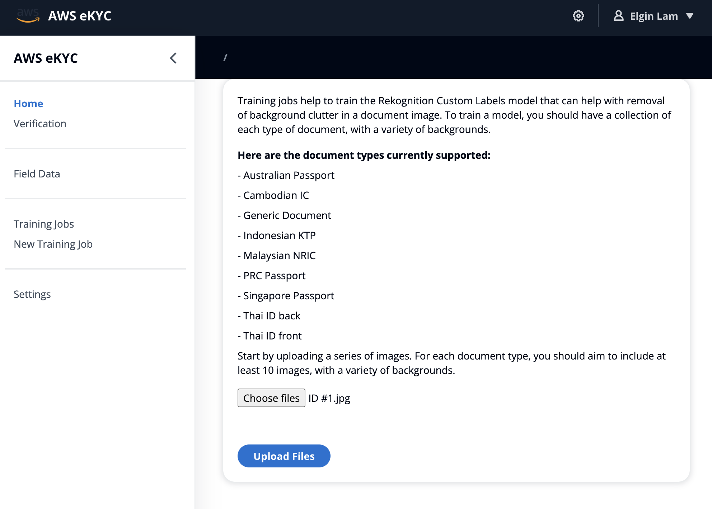
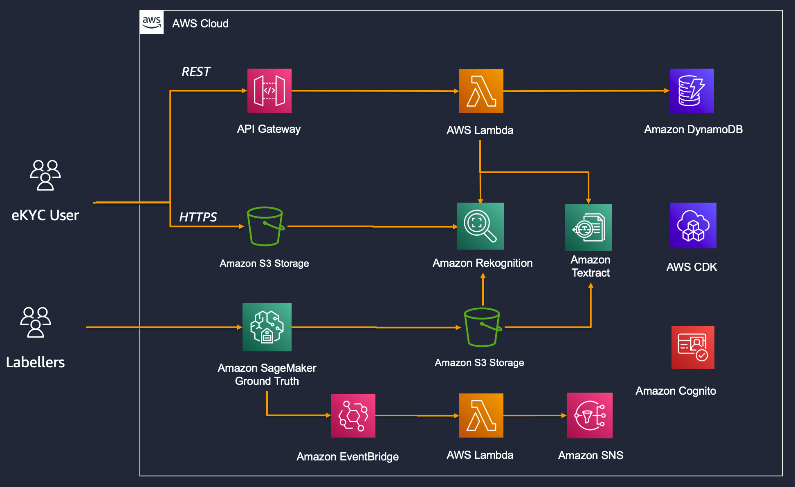

# AWS Prototyping eKYC Solution
∏
This is an "electronic know your customer" solution that is designed to help you fast-track your development of your own solution. It is not meant to be a production-ready solution, and will require further development and operational guardrails to be ready for production use.

## What is eKYC?

eKYC (electronic know-your-customer) is a process where institutions like banks, telcos and government entities can verify the identity of a person remotely. This solution includes the following capabilities:

- Identifying types of documents
- Identitying and extracting data from documents
- Verification of the identity of a customer remotely, using a client like a mobile app or web application

## Why implement eKYC?

The eKYC market is expected to grow by 20% annually, having been valued at US$212m in 2018. The APAC region is expected to see a large part of this growth, as the middle class is rapidly expanding and more and more are wanting access to services like bank accounts. The COVID-19 pandemic has also increased the demand for eKYC as institutions try to conduct business without putting customers and staff at risk.

## Features of the Solution

### Field Data Extraction

Extracts data from documents in a useful format for use in downstream applications. This uses a combination of AWS services and custom coordinate mapping.

The current solution supports the following types of documents for field extraction:

- Malaysian NRIC (MyKAD)
- Indonesian ID (KTP)
- Cambodian ID
- PRC Passport
- Australian Passport

Support for additional document types can be added, please view the instructions in [this document](docs/api/readme.md)

### Face Extraction

This extracts faces from documents, returning the resulting image in a Base64 format.

### Liveness Detection

This allows for checking of the liveness of a person, i.e. establishing whether the person who is in front of the camera is the person on the document. A document with a photo is required for this functionality. [Amazon Rekognition's](https://aws.amazon.com/rekognition/face-liveness/) liveness check feature is used to establish liveness and perform facial comparisons.

### User Interface

The web interface under /packages/ui is designed to allow you to test the functionality of the prototype. There are 5 functions on the user interface.

*New Session*: This creates a new liveness check interactive session

*Get Field Data*: This allows you to upload or take photos of documents for extracting of field data

*Verification History*: A listing of previous attempts to perform liveness checks

*Training Jobs*: A listing of training jobs that have been started

*New Training Job*: Create a new training job by uploading images

The user interface is a React.js application that is found under /packages/ui . The application utilises an open source framework called “Northstar” to emulate the styling of the AWS Management Console. More information about Northstar is available [here](https://northstar.aws-prototyping.cloud/). 

## Design of the Solution

The architecture developed for this prototype consists primarily of a serverless API service deployed using API Gateway and backed by AWS Lambda. Using the AWS Serverless API architecture, you can reap the benefits of not having to run any local on-premise infrastructure or having to provision instances, load balancers or worry about patching. You can also optimise your costs by only paying for what you use, and not be exposed to any security vulnerabilities as the AWS infrastructure is completely managed on your behalf.

The API Gateway forwards HTTP requests to an AWS Lambda function, which is developed as an ASP.NET Core Web API. The AWS Lambda function is running in proxy mode. In HTTP proxy integration, API Gateway passes the client-submitted method request to the backend. The request data that is passed through includes the request headers, query string parameters, URL path variables, and payload. The backend AWS Lambda function which is handled by the ASP.NET Core Web API parses the incoming request data to determine the response that it returns.
https://docs.aws.amazon.com/apigateway/latest/developerguide/api-gateway-create-api-as-simple-proxy-for-http.html

Please view the readme file in the `docs/api` folder for further information. The API code can be found in `packages/ekyc-api` folder.

AWS CDK is used to define the cloud infrastructure as code and provision it through AWS CloudFormation. The CDK packages can be found in the `infra` folder.

Before the deployment of the CDK stack, it is recommended that you run the synthesized CloudFormation template via the cfn_nag tool to help pick up any vulnerabilities you may be deploying. To do this, run `cdk synth` to create the CloudFormation template, then `cfn_nag_scan -i infra/cdk.out/EkycInfraStack.template.json`. Inspect the output, and consider remediating the issues before you deploy.

## Model Training

The API requires a Rekognition Custom Labels object detection model to be trained in order to accurately detect text on documents.
The process to train and host a Rekognition Custom Labels model can be found [here](https://docs.aws.amazon.com/rekognition/latest/customlabels-dg/gs-step-choose-example-project.html). Drawing bounding boxes for training data can either be done within the Rekognition console, or via an [Amazon SageMaker Ground Truth](https://aws.amazon.com/sagemaker/groundtruth/) job.

Further information about the training process can be found in `docs/ml-pipeline`. 

## Post Deployment Scripts

After the CDK deployment is complete, there are 2 tasks that are handled by the post deployment script at `packages/PostDeploymentScripts`. The first script, `AmplifyConfigWriter`, copies the UI configuration from the CDK output to the correct folder. The second script updates the Cognito User Pool Client subdomains with the correct SageMaker Ground Truth workforce domains.

## Pre-Requisites

- [.NET Core 6.0 LTS](https://dotnet.microsoft.com/en-us/download/dotnet/6.0)
- [Node.js 18 LTS](https://nodejs.org/en/)
- [Yarn](https://classic.yarnpkg.com/en/)
- [Access to an AWS account](https://aws.amazon.com/account/)
- [AWS CLI](https://docs.aws.amazon.com/cli/latest/userguide/getting-started-install.html)
- [AWS CDK](https://docs.aws.amazon.com/cdk/latest/guide/getting_started.html)
- [cfn_nag](https://github.com/stelligent/cfn_nag)
- [Swagger Code-Gen](https://github.com/swagger-api/swagger-editor) (optional)

## AWS Services

In order to be able to make full use of the functionality of this prototype, it is recommended that you gain familiarity with the following AWS services.

- [API Gateway](https://aws.amazon.com/api-gateway/)
- [Amazon Cognito](https://aws.amazon.com/cognito/)
- [AWS Lambda](https://aws.amazon.com/lambda/)
- [AWS IAM](https://aws.amazon.com/iam/)
- [Amazon S3](https://aws.amazon.com/s3/)
- [Amazon SageMaker Ground Truth](https://aws.amazon.com/sagemaker/groundtruth/)
- [DynamoDB](https://aws.amazon.com/dynamodb/)
- [Amazon Rekognition](https://aws.amazon.com/rekognition/) and [Custom Labels](https://aws.amazon.com/rekognition/custom-labels-features/)
- [EventBridge](https://aws.amazon.com/eventbridge/)
- [CloudWatch](https://aws.amazon.com/cloudwatch/) and [XRay](https://aws.amazon.com/xray/)
- [Amazon Textract](https://aws.amazon.com/textract/)

## Architecture

## One Step Deployment

Run the `one-step-deploy.sh` script in the base folder. You might need to provide execution access to the file by running `chmod +x one-step-deploy.sh`

Ensure your AWS credentials are setup in the CLI by running `aws configure`.

## Contributing

Contributing guidelines are available [here](CONTRIBUTING.md)

# License

This project is licensed under MIT-0. View license terms [here](LICENSE.md)
