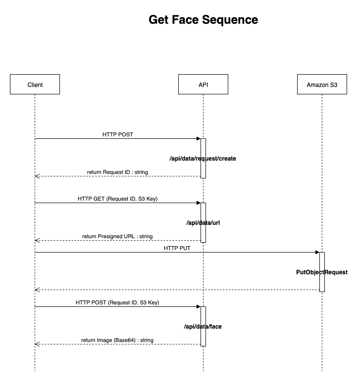
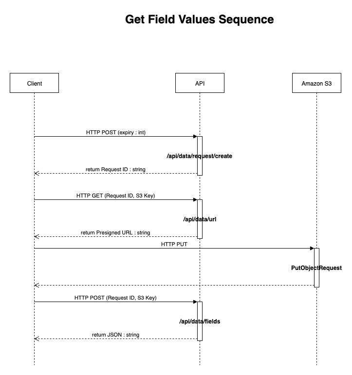
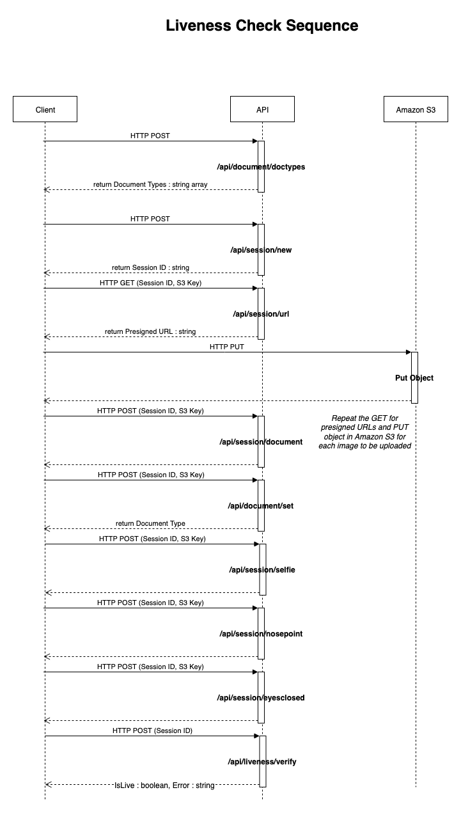

# eKYC API

## Objective

The eKYC API provides client applications with the capability to extract text, facial images and provide checks for liveness on documents.

## Calling the API

The endpoint for the API is generated upon deployment of the CDK package. You can see the endpoint in the output of the CDK deployment.

Be sure to append the full path of the API methods to the API endpoint (e.g. https://my-endpoint/uat/api/document/doctypes instead of https://my-endpoint/uat/document/doctypes)

The API is REST-based, and can be called over HTTPS.

A breakdown of the various methods for the API is available [here](swagger.json).

The JSON file is based on the OpenAPI standard, and you can use the web-based [Swagger Editor](https://editor.swagger.io/) to view the file. Select File -> Import File to visualise the JSON file.

## Sequence of API Calls

The APIs should be called in sequence, depending on the type of functionality desired.

### Extracting Face Data

Face detection is done using Amazon Rekognition’s DetectFaces API - https://docs.aws.amazon.com/rekognition/latest/dg/API_DetectFaces.html . Once a face bounding box has been detected, it is extracted out from the image and returned as a base64 string in the response. 
Calls to the API need to be done in a sequence. The first call creates a document request, and returns the ID of the request. Subsequent calls should use this document request ID to obtain a pre-signed URL and results. The sequence for extracting faces is as follows:



Images for analysis are uploaded via a HTTP PUT to Amazon S3 using the pre-signed URL. The object key is generated on the client-side, and the only constraint is that the uploaded file is a JPG or PNG file.

### Extracting Field Data

The field values on documents are obtained in 2 ways. Firstly, Amazon Textract’s Analyze ID API is used to return the text and bounding boxes of text on the card, and then using code constructs to determine what text it is – 
https://docs.aws.amazon.com/textract/latest/dg/API_AnalyzeID.html  Once the text has been returned, a combination of location coordinates and regular expressions are used to determine text validity.

The image is first pre-processed to improve the accuracy of text detection. This is done by making the image black and white, increasing the contrast and brightness of the image. The pre-processing parameters can be tweaked and refined to improve the accuracy of the results returned from Textract. The pre-processing code can be found in `packages/ekyc-api/src/ekyc-api/DocumentDefinitions/<DocumentType>/<DocumentType>_DocumentDefinition.cs`

The sequence of calls to extract field data is similar to that of obtaining face data. 

The sequence of calls that should be made is as follows:



### Liveness Verification

The 3rd function of the API allows for checking of the liveness of a person, i.e. establishing whether the person who is in front of the camera is the person on the document. A document with a photo is required for this functionality.

The 3rd function of the API allows for checking of the liveness of a person, i.e. establishing whether the person who is in front of the camera is the person on the document. The liveness check uses the liveness detection feature of Amazon Rekognition, along with the [Amplify component](https://ui.docs.amplify.aws/react/connected-components/liveness) To demonstrate how Rekognition liveness detection works against certain spoofing scenarios, [watch this video](https://www.youtube.com/watch?v=JfzwVl1wy0s&ab_channel=AmazonWebServices).  Amplify’s liveness detection also includes components for native Android and Swift applications.




## Authentication

The API is secured via Amazon Cognito User Pools https://docs.aws.amazon.com/cognito/latest/developerguide/cognito-user-identity-pools.html. This allows you to manage millions of users and also support any OpenID authentication methods. To integrate Amazon Cognito into your client application without heavy lifting, the user interface uses the AWS Amplify library [https://docs.amplify.aws/lib/auth/getting-started/]. 

### Testing Authentication Support for Postman

To perform testing in a tool like Postman, you can obtain tokens from Cognito and insert them into the 'Authorization' header of your HTTP requests. To obtain tokens, run the following command, replacing the values with their actual ones. 

`aws cognito-idp initiate-auth  --region ap-southeast-1 --auth-flow USER_PASSWORD_AUTH --auth-parameters USERNAME=<REPLACE>,PASSWORD=<REPLACE> --client-id <REPLACE>`

Use the "IdToken" string from the returned JSON to embed into your Authorization header, with the "Bearer" prefix.

## Support for Document Types

The current solution supports the following types of documents:

- Malaysian NRIC (MyKAD)
- Indonesian ID (KTP)
- Cambodian ID
- PRC Passport
- Australian Passport

### Adding support for further document types

You can add support for further document types using the following process. Let's take a fictitious document type called AcmeDoc as an example.

- Add the document type to the C# enumeration `DocumentTypes`. This enumeration can be found in `ekyc-api/src/ekyc-api/DataDefinitions/Types.cs`.
You'd end up with an enum like this:
  ```public enum DocumentTypes
  {
    ACME_DOC,
    ID_KTP,
    MY_NRIC,
    AU_PASSPORT,
    KH_IC,
    PRC_PASSPORT
  }
  ```
- Create a folder under `ekyc-api/src/ekyc-api/DocumentDefinitions` with the document code, e.g. AcmeDoc.
- Create a C# class that inherits from `DocumentDefinitionBase`. Implement the abstract methods and properties using the guidance from the comments in the base class.
- By default, all field extraction uses the [Amazon Textract Analyze ID](https://docs.aws.amazon.com/textract/latest/dg/how-it-works-identity.html) API to detect field data. However, depending on the document type, you might need to do some custom coding in instances where the default functionality does not fully cater for your use case. In this instance, you can either override the `GetFieldData` method to completely implement the data field extraction functionality yourself, or if you just want to do some post-processing of the default field capture, override the `PostProcessFieldData` method.

It is also possible to modify the default field data extraction method by going to AWS Systems Manager and modifying the Parameter Store value of the string parameter starting with `CFN-parametersekycfieldextractionmethod` to true. This will use a form of field extraction called coordinate mapping. 

Coordinate mapping works by specifying coordinates on documents relating to fields. This is useful when there are no distinguishing headers to work with to help with mapping data to field names.

Taking the following (obviously fake) example:


We can assume that whatever falls within the blue box is going to be the person’s name. All bounding boxes must be defined as a percentage of the entire image’s width and height. The 4 coordinates that need to be defined for a bounding box are:

-	Width (how wide the box is in relation to the width of the image)
-	Height (how high the box is in relation to the height of the image)
-	Top (the top of the box in relation to the height of the image. This starts from 0, which is the top of the image)
-	Left (the left side of the box in relation to the width of the image. This starts from 0, which is the left of the image)

In this case, we will specify the width of the name field as 0.45, height as 0.15, top as 0.70 and left as 0.05. To specify the coordinates for fields, use the JSON file under `packages/ekyc-api/src/ekyc-api/DocumentDefinitions/documentdefinitions`.json. You will need to re-deploy the solution after updating this file.

## Solution Structure

### Concepts

The solution makes use of the [dependency injection framework](https://docs.microsoft.com/en-us/aspnet/core/fundamentals/dependency-injection?view=aspnetcore-6.0) for ASP.NET Core. Dependency injection (DI) is a software design pattern, which is a technique for achieving Inversion of Control (IoC) between classes and their dependencies.

The solution uses the AWS .NET SDK to communicate with AWS services. AWS services also utilise the dependency injection concept as stated [here](https://aws.amazon.com/blogs/developer/working-with-dependency-injection-in-net-standard-inject-your-aws-clients-part-1/).

