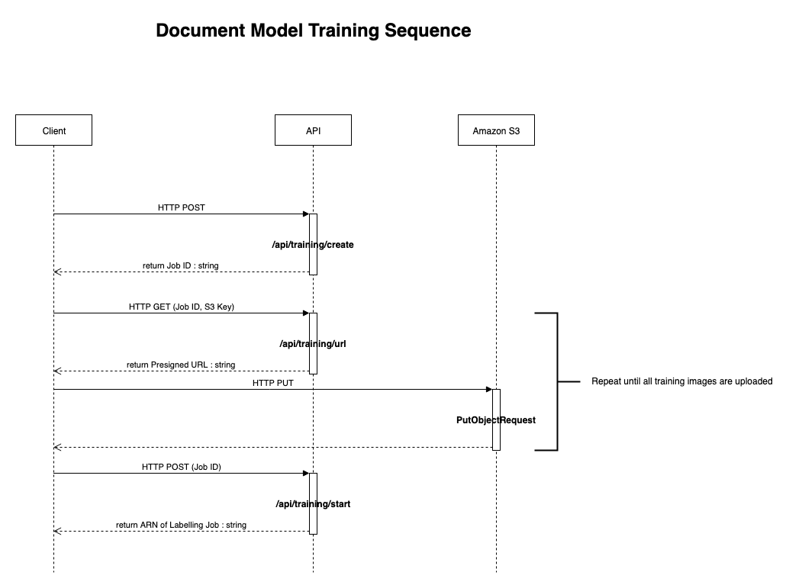
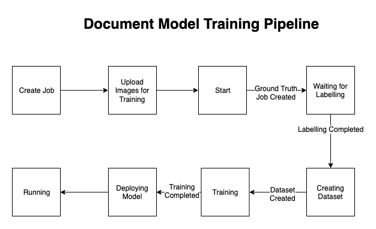

# eKYC Rekognition Custom Labels Training Pipeline

## Objective

The eKYC solution requires a Rekognition custom labels model to be trained. This is for the following purposes:

- Detection of document types
- Cropping out of the image backgrounds to improve accuracy of field extraction

To train the custom labels model, a sequence of calls must be made to the eKYC API.

## 1. Creating the Training Job

The first step is creating the training job by doing a HTTP POST to `/api/training/create`. This creates the training job in the database and provides an ID for calling other methods.

## 2. Uploading Images for Training

To upload images for training, call the `/api/training/url` with a HTTP GET request. This will provide a pre-signed URL where you can do a HTTP PUT for the images you want to use for training. For each image, you should call `/api/training/url` with the Job ID and the filename of the image. Do not reuse the same filename for the same job. 

## 3. Starting the Pipeline

The pipeline can be started by calling `/api/training/start`. Make sure you have a good number of images for each document type before starting the pipeline.

Here is a sequence of calls that should be made:

## 4. Labelling

The pipeline creates an Amazon SageMaker Ground Truth labelling job. You can use your own employees or an external vendor to assist with the labelling. The labelling task is to draw bounding boxes around the documents using the right document type. Click [here](https://docs.aws.amazon.com/sagemaker/latest/dg/sms-bounding-box.html) for more information.

## 5. Dataset Creation

Once labelling is complete, a Lambda function is triggered by EventBridge to commence dataset creation. This process can take a while. The Lambda function that is responsible for handling this is found in `packages/lambdas/GroundTruthJobHandler`.

## 6. Training

Once the dataset has been created, model training begins. Because there is currently no EventBridge support for Rekognition, a scheduled Lambda runs every 15 minutes to perform checking for datasets that have completed creation. This Lambda function can be found in `packages/lambdas/CheckRekognitionProject` The Lambda then starts up the model.

### 7. Deployment

Upon completion of training, the pipeline starts the Rekognition Project Version endpoint, which allows inference to be done.

**(Rekognition custom label projects accrue cost when running - make sure you stop the project version if you are not using it. The pipeline will NOT do this automatically for you.)**

